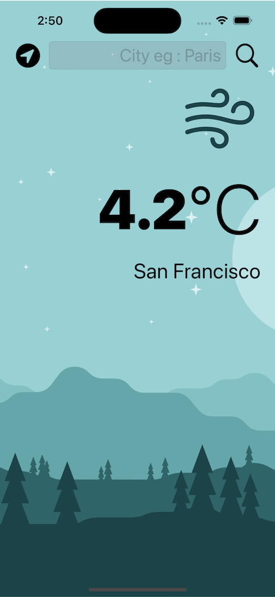
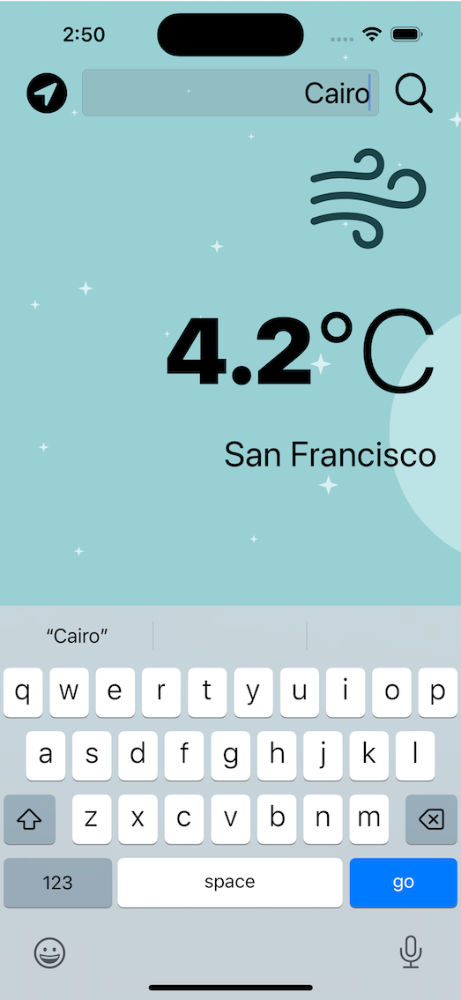
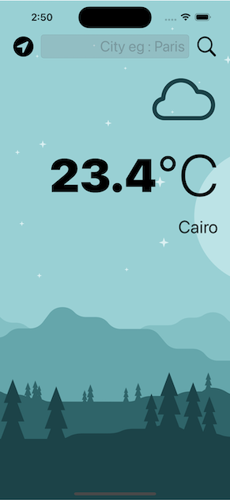

#  Clima

A Weather app using Openweathermap.org APIs. You'll be able to check the weather for the current location based on the GPS data from the iPhone as well as by searching for a city manually. 

## What app Include

* A dark-mode enabled app.
* Delegate pattern.
* Swift protocols and extensions. 
* Swift guard keyword. 
* Swift computed properties.
* Swift closures and completion handlers.
* URLSession to network and make HTTP requests.
* Parse JSON with the native Encodable and Decodable protocols. 
* Use Core Location to get the current location from the phone GPS. 

